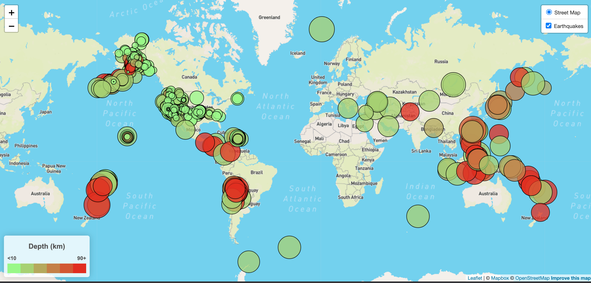
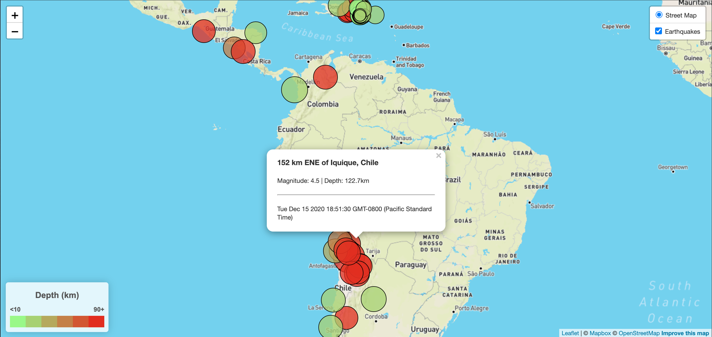

# leaflet-challenge
Earthquake data mapping

For this project, I was asked to use data from [USGS](https://earthquake.usgs.gov/earthquakes/feed/v1.0/geojson.php#earthquakes) to create a map using Leaflet.js and display all the earthquakes included in the selected GeoJSON file (I chose [all earthquakes in the last 7 days](https://earthquake.usgs.gov/earthquakes/feed/v1.0/summary/all_week.geojson)). I also had to include a clickable popup info box for each data point, showing the location, magnitude, and depth of each earthquake.

## Leaflet Step 1

From the selected dataset and map, I was required to plot the size of the marker based on the magnitude, and create a color code based on the depth of the earthquake.

### Example screenshots

